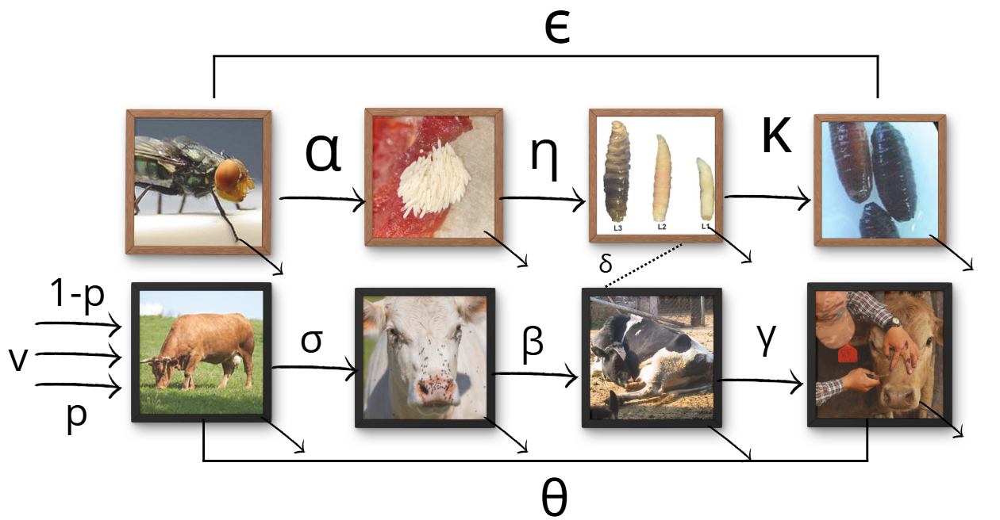

```{r setup, include=FALSE}
knitr::opts_chunk$set(echo = TRUE)
```

# Introducción

La reemergencia de la miasis por *Cochliomyia hominivorax* en México durante 2024 evidenció la necesidad de herramientas analíticas que permitan comprender la dinámica que favorece su persistencia en sistemas ganaderos. Como extensión del proyecto original presentado en la materia `proyecto de investigación`, la presente sección se enfoca exclusivamente en la construcción, calibración y validación de un modelo compartimental. Este modelo busca integrar parámetros biológicos, climáticos y socioeconómicos asociados al rebrote registrado en el estado de Chiapas, con el fin de identificar los factores que contribuyeron a su aparición y mantenimiento.

Los modelos compartimentales permiten descomponer procesos complejos en transiciones ordenadas entre estados epidemiológicos. Para *C. hominivorax*, esta aproximación resulta adecuada debido a que su ciclo incluye etapas definidas que pueden representarse mediante compartimentos susceptibles, expuestos, infestados y recuperados. A diferencia de las simulaciones centradas en la TIE (Técnica del Insecto Estéril) o modelos climáticos aislados, esta propuesta integra múltiples componentes para generar un panorama mayor de la dinámica observada.

# Antecedentes

La literatura existente documenta modelos enfocados principalmente en evaluar estrategias de liberación de machos estériles (Dhahbi et al., 2020) y modelos ecofisiológicos que analizan el efecto del clima sobre la distribución del parásito (Gutiérrez et al., 2019). Sin embargo, no se han encontrado modelos que incorporen lo siguiente:

1.  Ciclo de vida del parásito.
2.  Datos climáticos (humedad, precipitación y temperatura)
3.  Componentes socioeconómicos (entrada legal e ilegal de ganado)

Por ello, se plantea el desarrollo de un modelo SEIRS expandido que capture las transiciones biológicas del gusano, su interacción con factores ambientales y socioeconomicos.

# Objetivos

## Objetivo general

Desarrollar y validar un modelo epidemiológico SEIRS expandido que represente la dinámica del rebrote de miasis por *C. hominivorax* en Chiapas, integrando parámetros biológicos, climáticos y socioeconómicos.

## Objetivos específicos

1.  Construir un modelo compartimental SEIRS que represente la dinámica de infestación en ganado bovino.
2.  Obtener y depurar parámetros biológicos y ambientales mediante revisión documental y bases oficiales.
3.  Implementar análisis de sensibilidad local y global utilizando muestreo tipo Latin Hypercube e índices de Sobol.
4.  Simular escenarios antes, durante y después del rebrote a fin de identificar los parámetros con mayor influencia en la dinámica observada.

# Metodología

## Integración y curación de bases de datos

La información se recopilará desde fuentes oficiales y científicas, incluyendo:

-   SENASICA/SADER: número de casos confirmados y sus fechas.

-   INEGI: ingreso de ganado.

-   USDA/COMEXA: frecuencia y volumen de liberaciones de machos estériles.

-   CONAGUA: registros de precipitación, humedad relativa y temperatura.

-   **Además de referencias como:**

    **(ingresar bibliografía de dónde se sacan tasas sobre el ciclo de vida de la larva) Literatura especializada: tasas biológicas (oviposición, maduración larvaria, pupación, emergencia y longevidad).**

## Formulación del modelo SEIRS expandido

El modelo propuesto describe la dinámica epidemiológica de la miasis por *Cochliomyia hominivorax* en bovinos mediante un esquema compartimental tipo SEIRS. El flujo básico considera cuatro estados:

$$
S \rightarrow E \rightarrow I \rightarrow R \rightarrow S
$$

donde:

-   **S**: bovinos susceptibles.
-   **E**: bovinos expuestos (oviposición o presencia temprana de larvas).
-   **I**: bovinos infestados (lesiones con larvas activas).
-   **R**: bovinos recuperados temporalmente (lesiones tratadas o cicatrizadas).

El retorno $R \rightarrow S$ representa la **pérdida de protección**, la **generación de nuevas heridas**, o el **reinicio del riesgo** tras la curación.

Además del ciclo SEIRS en bovinos, se incorpora explícitamente el ciclo biológico del gusano barrenador:

$$
A \rightarrow H \rightarrow L \rightarrow P
$$

con:

-   **A** = adultos (moscas reproductivas)
-   **H** = huevos
-   **L** = larvas
-   **P** = pupas

Estos dos subsistemas se acoplan mediante la **fuerza de infestación**, que depende del número de adultos y del clima.

### Módulos adicionales del modelo

A continuación se describen los tres módulos que complementan el modelo SEIRS y que permiten incorporar mejor las condiciones reales del rebrote.

### **Módulo climático**

El desarrollo del gusano barrenador depende mucho del clima. Para que pase de huevo → larva → pupa → adulto, necesita buena temperatura, suficiente humedad y lluvia.\
Por eso, cada parámetro del ciclo biológico ($\alpha, \eta, \kappa, \epsilon$) se ajusta con una función que nos dice **qué tan favorable es el clima** en ese momento.

La función combina temperatura (T), precipitación (P) y humedad (H):

$$
f_c(T, P, H) = 
\left( \frac{T - T_{min}}{K} \right)
\left( \frac{P - P_{min}}{K} \right)
\left( \frac{H - H_{min}}{K} \right)
$$

-   Si el clima está “ideal”, la función da valores grandes y el gusano se desarrolla rápido.
-   Si el clima está “malo”, los valores bajan y el desarrollo se frena.

Este factor se multiplica directamente en tus parámetros de paso:

-   $\alpha$ : oviposición ajustada
-   $\eta$ : paso huevo → larva
-   $\kappa$ : paso larva → pupa
-   $\epsilon$ : paso pupa → adulto

Así el modelo reacciona automáticamente a las condiciones reales.

### **Módulo socioeconómico**

Además del clima, la entrada de animales al estado afecta la dinámica de la miasis. Aquí se consideran dos tipos:

-   **entrada legal**, que aumenta bovinos susceptibles registrados,
-   **entrada ilegal**, que puede mover casos entre municipios sin registros oficiales.

Como no podemos medir exactamente cuánto ganado ilegal entra, usamos un ajuste sencillo:

$$
\rho = \frac{\text{incautaciones}}{\text{estimación total}}
$$

Este ajuste representa el nivel de ganado ilegal que pudo entrar. Lo cual influye directamente en:

-   la cantidad de bovinos susceptibles $S$

-   la posibilidad de introducir animales infestados

-   y el mantenimiento del riesgo durante el rebrote

    **Módulo de mitigación**

Este módulo representa la **Técnica del Insecto Estéril (TIE)**, que disminuye la reproducción del gusano.

Cuando se liberan machos estériles, compiten con los machos normales, pero si una hembra se aparea con un macho estéril, los huevos no son viables.\
En el modelo esto se ajusta modificando la oviposición real:

$$
\alpha_{ef} = \alpha (1 - u)
$$

donde:

-   $u$ = proporción de hembras que sí fueron fecundadas por machos estériles.

Entre mayor sea $u$, menor es la oviposición efectiva, y por lo tanto, disminuye la producción de larvas.

Este módulo permite simular escenarios con liberaciones bajas, medias o intensivas.



**A continuación se presenta la formulación del modelo completo mediante ecuaciones diferenciales:**
