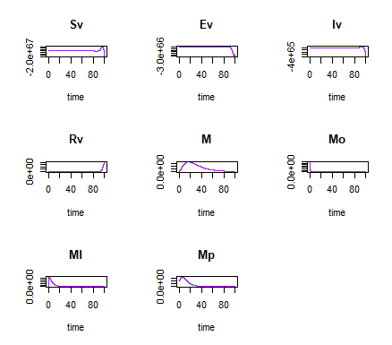
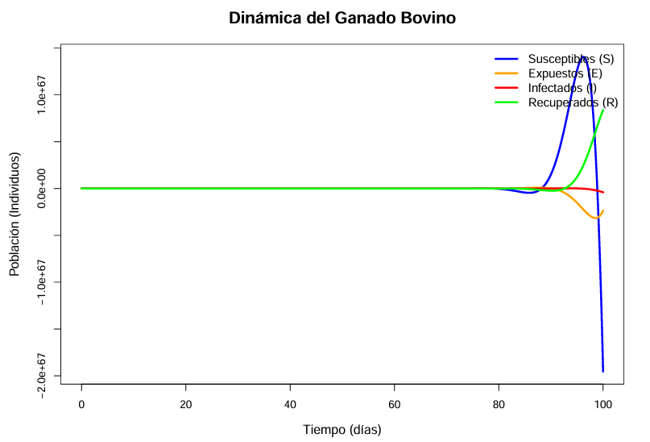
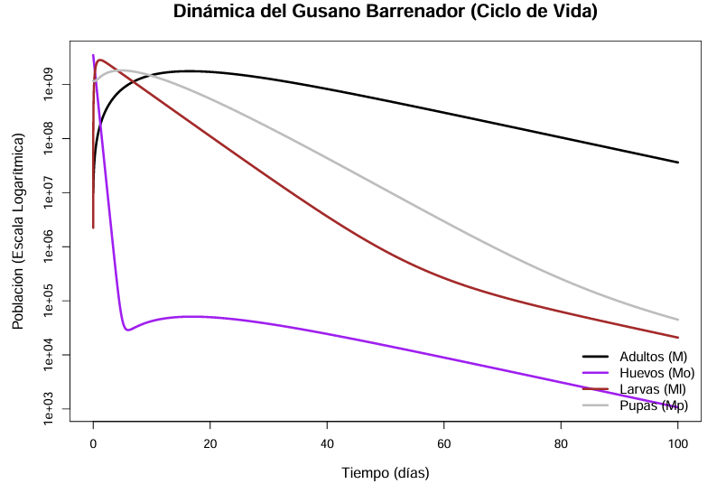
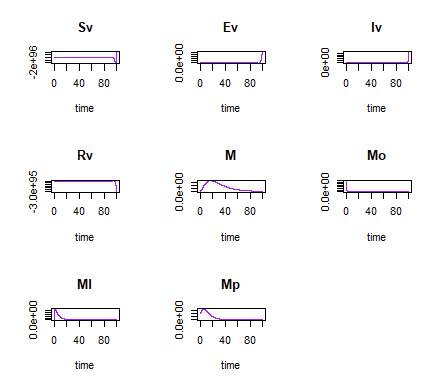
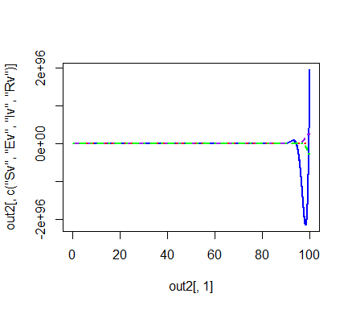
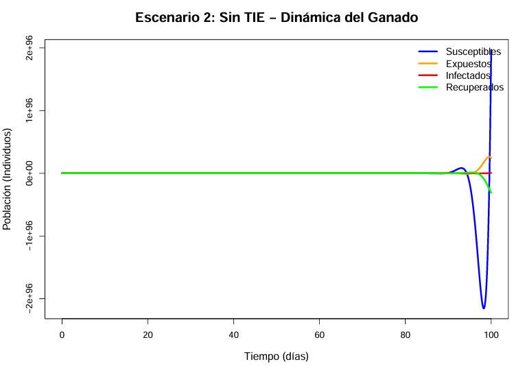
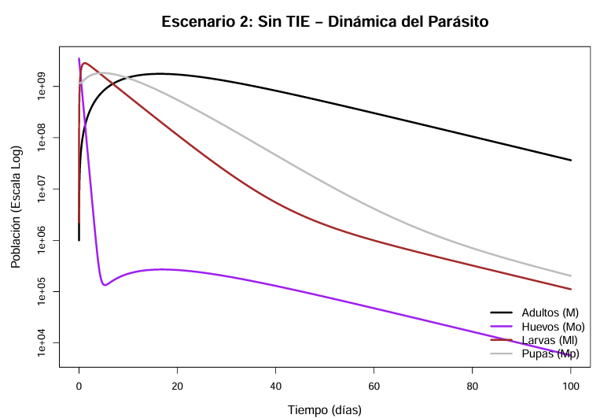
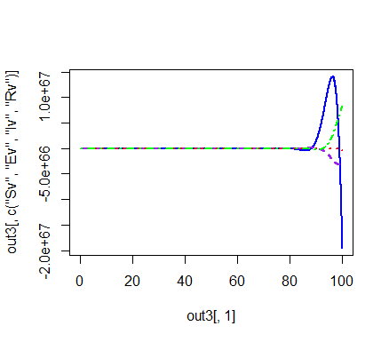
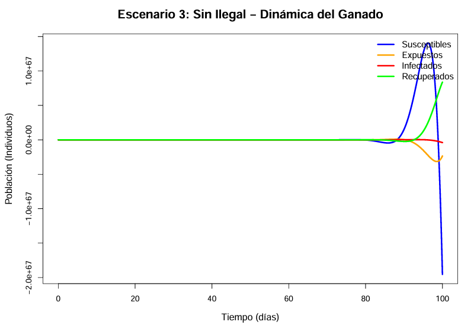
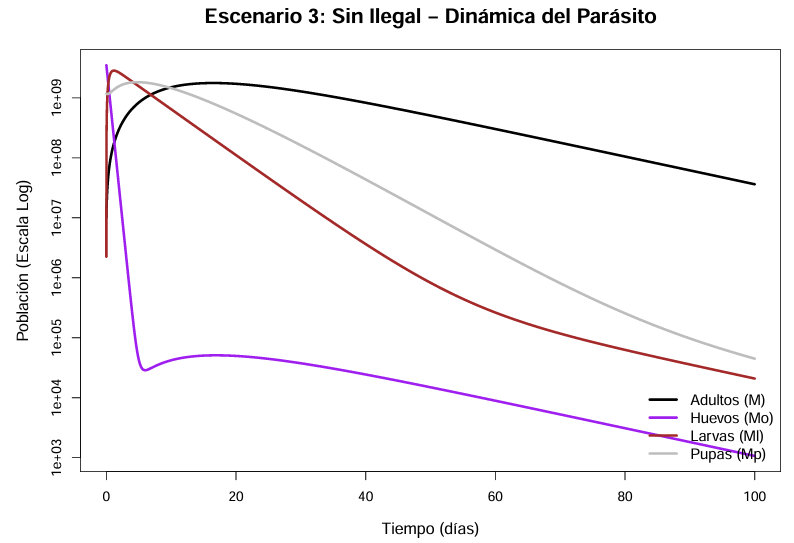

```{r setup, include=FALSE}
knitr::opts_chunk$set(echo = TRUE)
```

# Introducción

La reemergencia de la miasis por *Cochliomyia hominivorax* en México durante 2024 evidenció la necesidad de herramientas analíticas que permitan comprender la dinámica que favorece su persistencia en sistemas ganaderos. Como extensión del proyecto original presentado en la materia `proyecto de investigación`, la presente sección se enfoca exclusivamente en la construcción, calibración y validación de un modelo compartimental. Este modelo busca integrar parámetros biológicos, climáticos y socioeconómicos asociados al rebrote registrado en el estado de Chiapas, con el fin de identificar los factores que contribuyeron a su aparición y mantenimiento.

Los modelos compartimentales permiten descomponer procesos complejos en transiciones ordenadas entre estados epidemiológicos. Para *C. hominivorax*, esta aproximación resulta adecuada debido a que su ciclo incluye etapas definidas que pueden representarse mediante compartimentos susceptibles, expuestos, infestados y recuperados. A diferencia de las simulaciones centradas en la TIE (Técnica del Insecto Estéril) o modelos climáticos aislados, esta propuesta integra múltiples componentes para generar un panorama mayor de la dinámica observada.

# Antecedentes

La literatura existente documenta modelos enfocados principalmente en evaluar estrategias de liberación de machos estériles (Dhahbi et al., 2020) y modelos ecofisiológicos que analizan el efecto del clima sobre la distribución del parásito (Gutiérrez et al., 2019). Sin embargo, no se han encontrado modelos que incorporen lo siguiente:

1.  Ciclo de vida del parásito.
2.  Datos climáticos (humedad, precipitación y temperatura)
3.  Componentes socioeconómicos (entrada legal e ilegal de ganado)

Por ello, se plantea el desarrollo de un modelo SEIRS expandido que capture las transiciones biológicas del gusano, su interacción con factores ambientales y socioeconomicos.

# Objetivos

## Objetivo general

Desarrollar y validar un modelo epidemiológico SEIRS expandido que represente la dinámica del rebrote de miasis por *C. hominivorax* en Chiapas, integrando parámetros biológicos, climáticos y socioeconómicos.

## Objetivos específicos

1.  Construir un modelo compartimental SEIRS que represente la dinámica de infestación en ganado bovino.
2.  Obtener y depurar parámetros biológicos y ambientales mediante revisión documental y bases oficiales.
3.  Implementar análisis de sensibilidad local y global utilizando muestreo tipo Latin Hypercube e índices de Sobol.
4.  Simular escenarios antes, durante y después del rebrote a fin de identificar los parámetros con mayor influencia en la dinámica observada.

# Metodología

## Integración y curación de bases de datos

La información se recopilará desde fuentes oficiales y científicas, incluyendo:

-   SENASICA/SADER: número de casos confirmados y sus fechas.

-   INEGI: ingreso de ganado.

-   USDA/COMEXA: frecuencia y volumen de liberaciones de machos estériles.

-   CONAGUA: registros de precipitación, humedad relativa y temperatura.

-   **Además de referencias como:**

    **(ingresar bibliografía de dónde se sacan tasas sobre el ciclo de vida de la larva) Literatura especializada: tasas biológicas (oviposición, maduración larvaria, pupación, emergencia y longevidad).**

## Formulación del modelo SEIRS expandido

El modelo propuesto describe la dinámica epidemiológica de la miasis por *Cochliomyia hominivorax* en bovinos mediante un esquema compartimental tipo SEIRS. El flujo básico considera cuatro estados:

$$
S \rightarrow E \rightarrow I \rightarrow R \rightarrow S
$$

donde:

-   **S**: bovinos susceptibles.
-   **E**: bovinos expuestos (oviposición o presencia temprana de larvas).
-   **I**: bovinos infestados (lesiones con larvas activas).
-   **R**: bovinos recuperados temporalmente (lesiones tratadas o cicatrizadas).

El retorno $R \rightarrow S$ representa la **pérdida de protección**, la **generación de nuevas heridas**, o el **reinicio del riesgo** tras la curación.

Además del ciclo SEIRS en bovinos, se incorpora explícitamente el ciclo biológico del gusano barrenador:

$$
A \rightarrow H \rightarrow L \rightarrow P
$$

con:

-   **A** = adultos (moscas reproductivas)
-   **H** = huevos
-   **L** = larvas
-   **P** = pupas

Estos dos subsistemas se acoplan mediante la **fuerza de infestación**, que depende del número de adultos y del clima.

### Módulos adicionales del modelo

A continuación se describen los tres módulos que complementan el modelo SEIRS y que permiten incorporar mejor las condiciones reales del rebrote.

### **Módulo climático**

El desarrollo del gusano barrenador depende mucho del clima. Para que pase de huevo → larva → pupa → adulto, necesita buena temperatura, suficiente humedad y lluvia.\
Por eso, cada parámetro del ciclo biológico ($\alpha, \eta, \kappa, \epsilon$) se ajusta con una función que nos dice **qué tan favorable es el clima** en ese momento.

La función combina temperatura (T), precipitación (P) y humedad (H):

$$
f_c(T, P, H) = 
\left( \frac{T - T_{min}}{K} \right)
\left( \frac{P - P_{min}}{K} \right)
\left( \frac{H - H_{min}}{K} \right)
$$

-   Si el clima está “ideal”, la función da valores grandes y el gusano se desarrolla rápido.
-   Si el clima está “malo”, los valores bajan y el desarrollo se frena.

Este factor se multiplica directamente en tus parámetros de paso:

-   $\alpha$ : oviposición ajustada
-   $\eta$ : paso huevo → larva
-   $\kappa$ : paso larva → pupa
-   $\epsilon$ : paso pupa → adulto

Así el modelo reacciona automáticamente a las condiciones reales.

### **Módulo socioeconómico**

Además del clima, la entrada de animales al estado afecta la dinámica de la miasis. Aquí se consideran dos tipos:

-   **entrada legal**, que aumenta bovinos susceptibles registrados,
-   **entrada ilegal**, que puede mover casos entre municipios sin registros oficiales.

Como no podemos medir exactamente cuánto ganado ilegal entra, usamos un ajuste sencillo:

$$
\rho2 = \frac{\text{incautaciones}}{\text{estimación total}}
$$

Este ajuste representa el nivel de ganado ilegal que pudo entrar. Lo cual influye directamente en:

-   la cantidad de bovinos susceptibles $S$
-   la posibilidad de introducir animales infestados
-   y el mantenimiento del riesgo durante el rebrote

### Módulo de mitigación

Este módulo representa la **Técnica del Insecto Estéril (TIE)**, que disminuye la reproducción del gusano.

Cuando se liberan machos estériles, compiten con los machos normales, pero si una hembra se aparea con un macho estéril, los huevos no son viables.\
En el modelo esto se ajusta modificando la oviposición real:

$$
\alpha_{ef} = \alpha (1 - u)
$$

donde:

-   $u$ = proporción de hembras que sí fueron fecundadas por machos estériles.

Entre mayor sea $u$, menor es la oviposición efectiva, y por lo tanto, disminuye la producción de larvas.

Este módulo permite simular escenarios con liberaciones bajas, medias o intensivas.


**A continuación se presenta la formulación del modelo completo mediante ecuaciones diferenciales:**

La población total del hospedero es:

$$
N_v = S_v + E_v + I_v + R_v
$$

**Ecuaciones para el hospedero**

--\> Susceptibles

$$
\frac{dS_v}{dt}
= \text{natalidad} + p_1 + p_2
  - \sigma S_v \left(\frac{M}{N_v}\right)
  - \mu_v S_v
  + \theta R_v
$$

--\> Expuestos

$$
\frac{dE_v}{dt}
= \sigma S_v \left(\frac{M}{N_v}\right)
  - \beta E_v
  - \mu_v E_v
$$

--\> Infestados

$$
\frac{dI_v}{dt}
= \sigma S_v \left(\frac{M}{N_v}\right)
  - \beta E_v
  - \gamma I_v
  + \delta M_l I_v
  - \mu_v I_v
$$ --\> Recuperados

$$
\frac{dR_v}{dt}
= \gamma I_v
  - \mu_v R_v
  - \theta R_v
$$

**Ciclo del gusano barrenador**

--\> Adultos

$$
\frac{dM}{dt}
= \epsilon M_p
  - \alpha M
  - \mu_m M
$$

--\> Huevos

$$
\frac{dM_o}{dt}
= \alpha M
  - (\eta + \mu_m) M_o
$$

--\> Larvas

$$
\frac{dM_l}{dt}
= \eta M_o
  - (\kappa + \mu_m) M_l
$$

--\> Pupas

$$
\frac{dM_p}{dt}
= \kappa M_l
  - (\epsilon + \mu_m) M_p
$$

### Obtención de Parámetros

Estos se basan en la biología conocida de la mosca *Cochliomyia hominivorax* y se obtienen principalmente de literatura científica, estudios entomológicos y reportes de programas de erradicación (como el de COPEG o agencias gubernamentales como SENASICA/USDA). La siguiente información se obtuvo de SENASICA (2020):

-   El parámetro $\alpha_{\text{base}}$ representa la tasa promedio de producción de huevos por mosca adulta por día en condiciones ideales.$$\alpha_{\text{base}} = \frac{\text{Huevos totales puestos en su vida}}{\text{Esperanza de vida reproductiva de la hembra (días)}}$$

| **Dato Biológico** | **Valor** | **Uso en** $\alpha_{\text{base}}$ |
|:-----------------------|:-----------------------|:-----------------------|
| Población en $A$ | 50% Hembras, 50% Machos | Solo las hembras oviponen. |
| Oviposición por Masa | $200$ a $400$ huevos (Usamos $300$) | Se usa para calcular la producción total. |
| Masas Totales | Hasta cuatro masas de huevos en su vida. | Se usa para calcular la producción total. |
| Vida Reproductiva | El apareamiento ocurre entre el día 3-5, y la oviposición comienza al día 6. La vida es de $\approx 20$ días. | La fase reproductiva dura aproximadamente $20 - 6 = 14$ días. |

Cálculo:

1.  Huevos Totales por Hembra (en su vida):\
    $$
    \text{Huevos totales} = \text{Promedio de Huevos por Masa} \times \text{Número de Masas}
    $$ $$
    \text{Huevos totales} \approx 300 \text{ huevos/masa} \times 4 \text{ masas} = 1200 \text{ huevos}
    $$

2.  Tasa de Oviposición por Hembra (diaria, durante su vida reproductiva):\
    $$
    \text{Tasa Hembra} = \frac{1200 \text{ huevos}}{14 \text{ días}} \approx 85.7 \text{ huevos/día/hembra}
    $$

3.  Tasa de Oviposición por Adulto ($\alpha_{\text{base}}$):\
    Dado que el compartimento $A$ incluye machos y hembras (50% de cada uno),\
    la tasa promedio por individuo en $A$ es la mitad de la tasa de la hembra. $$
    \alpha_{\text{base}} = \text{Tasa Hembra} \times 0.50 \approx 85.7 \times 0.50 \approx 42.85
    $$

Valor que usaremos para el modelo: $\alpha_{\text{base}} \approx 43$ por día.

## Módulo de Mitigación: Técnica del Insecto Estéril (TIE)

La efectividad de la **Técnica del Insecto Estéril (TIE)** para reducir la tasa de oviposición de la mosca se cuantifica mediante el **factor de esterilidad** ($u$), que representa la proporción de apareamientos que resultan en huevos estériles.

------------------------------------------------------------------------

1.  Definición de la Competitividad ($C$)

La **competitividad** $C$ se usa porque el macho estéril no siempre compite igual que el silvestre. Por ello, se pondera su “calidad”.

Se tomó $C=0.5$ como **valor medio estimado** para *Cochliomyia hominivorax*, ya que se basa en la literatura de otros vectores, donde la competitividad suele rondar entre $0.3$ y $0.7$.

$$
\text{Competitividad } (C) = 0.5
$$

------------------------------------------------------------------------

2.  Cálculo de la Tasa de Esterilidad ($u$)

Para determinar $u$, se utilizan los datos del programa de liberación de SENASICA y la proporción de moscas estériles a silvestres.

**Datos de Liberación (SENASICA):** \* **Moscas estériles liberadas:** $885$ millones ($\text{lib}_{\text{tot}}$) en un periodo de $168$ días. \* **Tasa de liberación diaria (**$S$): $$S = \frac{885,000,000}{168 \text{ días}} \approx 5,267,857 \text{ moscas estériles/día}$$ \* **Población silvestre estimada (**$W$): El programa opera con una **relación de** $10$ moscas estériles por cada $1$ silvestre. $$W = \frac{5,267,857}{10} \approx 526,786 \text{ moscas silvestres/día}$$

**Cálculo de** $u$: Se sustituyen los valores en la fórmula de la proporción de apareamientos estériles:

$$
u = \frac{C \cdot S}{C \cdot S + W}
$$

$$
u = \frac{0.5 \cdot 5,267,857}{(0.5 \cdot 5,267,857) + 526,786} \approx 0.8333
$$

El factor de esterilidad obtenido es:

$$
u \approx 0.83
$$

Esto significa que alrededor del **83% de las hembras quedan estériles**.

------------------------------------------------------------------------

3.  Ajuste de la Fecundidad del Modelo

El factor $u$ se utiliza para **ajustar la fecundidad efectiva** del modelo, reduciendo la tasa de oviposición original ($\alpha_{\text{base}}$) mediante la siguiente relación:

$$
\alpha_{\text{efectiva}} = \alpha_{\text{base}} (1-u)
$$

Asumiendo que la tasa de oviposición base ($\alpha_{\text{base}}$) es de $43 \text{ huevos/día}$, con $u=0.83$ se obtiene:

$$
\alpha_{\text{ajustada}} = 43 \cdot (1 - 0.83) \approx 7.17 \text{ huevos/día}
$$

La tasa efectiva de oviposición utilizada en el modelo es:

$$
\alpha_{\text{ajustada}} \approx 7.17 \text{ huevos/día}
$$

Tasa de Mortalidad del Adulto ($\mu_A$)El parámetro $\mu_A$ es el inverso de la esperanza de vida promedio del adulto en la naturaleza.

-   Vida de los Machos: $14$ a $21$ días (Promedio: $17.5$ días)
-   Vida de las Hembras: $10$ a $30$ días (Promedio: $20$ días)
-   Vida Promedio Ponderada (asumiendo 50% machos, 50% hembras):$$\text{Vida Promedio} \approx \frac{17.5 + 20}{2} = 18.75 \text{ días}$$

La tasa de mortalidad diaria ($\mu_A$) se calcula como el inverso del tiempo promedio de vida:$$\mu_A = \frac{1}{\text{Vida Promedio}} \approx \frac{1}{18.75} \approx 0.0533$$ Valor que usaremos para el modelo: $\mu_A \approx 0.053$ por día

**Suposiciones para las Tasas de Mortalidad**

| **Parámetro** | **Fase** | **Suposición** | **Valor Sugerido (Diario)** | **Razón** |
|:--------------|:--------------|:--------------|:--------------|:--------------|
| $\mu_H$ | Huevo | Mínima mortalidad (principalmente por factores intrínsecos). | 0.005 (0.5%) | El texto SENASICA 2020 indica que eclosionan rápidamente (1 día). Los huevos en la masa están protegidos por la hembra y por estar en el borde de una herida (ambiente nutritivo). |
| $\mu_L$ | Larva | Mortalidad baja (protegida dentro del huésped). | 0.01 (1%) | La larva es un parásito obligado; está protegida dentro del tejido vivo de la herida. La principal amenaza es el tratamiento (que está fuera de esta $\mu$) o que la herida se seque. |
| $\mu_P$ | Pupa | Mortalidad más alta (fase ambiental más vulnerable). | 0.03 (3%) | La pupa se encuentra en el suelo, donde está expuesta a la depredación, inundaciones, desecación extrema o temperaturas desfavorables (aunque el clima base sea óptimo, hay riesgos). |

-   Para estimar directamente los parámetros de tasas de transición ($\eta, \kappa, \epsilon$) para el ciclo de vida del parásito ($H \rightarrow L \rightarrow P \rightarrow A$). Usaremos la siguiente formula

$$\text{Tasa de Transición } (\lambda) = \frac{1}{\text{Tiempo Promedio de la Fase } (\tau \text{ días})}$$

| **Parámetro** | **Fase** | **Duración Promedio (**$\tau$) | **Tasa Diaria (**$\lambda=1/\tau$) | **Valor que usaremos para el modelo** |
|:--------------|:--------------|:--------------|:--------------|:--------------|
| $\eta_{\text{base}}$ | Huevo $\rightarrow$ Larva | 0.4167 días | $1 / 0.4167$ | 2.4 |
| $\kappa_{\text{base}}$ | Larva $\rightarrow$ Pupa | 6 días | $1 / 6$ | 0.167 |
| $\epsilon_{\text{base}}$ | Pupa $\rightarrow$ Adulto | 8.5 días | $1 / 8.5$ | 0.118 |

### Parámetros del Compartimento Bovino (SEIRS)

Los parámetros del modelo SEIRS para bovinos se calculan utilizando datos epidemiológicos del rebrote de miasis por *Cochliomyia hominivorax* en Chiapas durante 2024-2025, en combinación con información biológica documentada por SENASICA.

**Notación de parámetros:**

-   $\sigma$: tasa de transición Susceptible → Expuesto (oviposición e incubación)
-   $\beta$: tasa de transición Expuesto → Infestado (desarrollo larvario temprano)
-   $\gamma$: tasa de transición Infestado → Recuperado (tratamiento y cicatrización)
-   $\theta$: tasa de transición Recuperado → Susceptible (pérdida de protección)

#### Obtención de Parámetros

Estos parámetros se basan en datos epidemiológicos oficiales de SENASICA/INEGI.

Parámetro $\sigma$ (Susceptible → Expuesto)

El parámetro $\sigma$ representa la **tasa de incidencia**, calculada a partir de la proporción de casos observados durante el período del brote.

**Paso 1: Cálculo de la proporción de incidencia**

La proporción de incidencia se calcula como la fracción de la población bovina que fue infestada durante el período del brote:

$$\text{Proporción de incidencia} = \frac{\text{Casos confirmados}}{\text{Población total}}$$

**Datos:**

|                                     | **Valor**            | **Fuente**      |
|:--------------------------------|:--------------------|:-----------------|
| Población bovina 2022 (Censo INEGI) | 1,653,718 cabezas    | INEGI (2022)    |
| Tasa de crecimiento anual           | 8.06%                | INEGI (2022)    |
| Período de proyección               | 2022 → 2025 (3 años) | \-              |
| Casos confirmados en Chiapas        | 1,326 casos          | SENASICA (2025) |

**Cálculo de la población bovina en 2025:**

$$N_{2025} = N_{2022} \times (1 + r)^t$$

$$N_{2025} = 1,653,718 \times (1.0806)^3 = 1,653,718 \times 1.2617 = 2,086,688 \text{ cabezas}$$

**Cálculo de la proporción de incidencia:**

$$\text{Proporción} = \frac{1,326}{2,086,688} = 6.35 \times 10^{-4}$$

**Paso 2: Conversión a tasa de incidencia**

$$\sigma = \frac{\text{Proporción de incidencia}}{\text{Duración del brote (días)}}$$

**Datos temporales del brote:**

|                        | **Valor**            | **Fuente**      |
|:-----------------------|:---------------------|:----------------|
| Inicio del brote       | Noviembre 2024       | SENASICA (2024) |
| Casos reportados hasta | 24 de noviembre 2025 | SENASICA (2025) |
| Duración del brote     | **365 días**         | Calculado       |

**Cálculo de** $\sigma$ **(tasa de incidencia):**

$$\sigma = \frac{6.35 \times 10^{-4}}{365 \text{ días}} = 1.74 \times 10^{-6} \text{ día}^{-1}$$

**Valor que usaremos para el modelo:** $\sigma \approx 1.74 \times 10^{-6}$ día$^{-1}$ (0.00000174 día$^{-1}$ )

## Parámetro $\sigma$ (Susceptible → Expuesto) - Período Pre-Erradicación

### Paso 1: Cálculo de la proporción de incidencia

$$\text{Proporción de incidencia} = \frac{\text{Casos confirmados}}{\text{Población total}}$$

**Datos:**

|   | **Valor** | **Fuente** |
|:--------------------------------|:-------------------|:------------------|
| Casos totales (1972-1990) | 286,750 casos | SENASICA |
| Población bovina México (\~1980-1990) | 24,600,000 cabezas | INEGI/SAGARPA (1991) |
| Período analizado | 1972 → 1990 (18 años) |  |

**Nota sobre la población:** Se utilizo la población bovina nacional de México estimada en aproximadamente 24.6 millones de cabezas durante el período 1980-1990, que representa el punto medio del período analizado.

**Cálculo de la proporción de incidencia:**

$$\text{Proporción} = \frac{286,750}{24,600,000} = 1.17 \times 10^{-2}$$

### Paso 2: Conversión a tasa de incidencia

Para obtener la tasa por día, dividimos la proporción entre la duración del período:

$$\sigma_{\text{pre-erradicación}} = \frac{\text{Proporción de incidencia}}{\text{Duración del período (días)}}$$

**Datos temporales del período pre-erradicación:**

|                      | **Valor**      |
|:---------------------|:---------------|
| Inicio del período   | 1972           |
| Fin del período      | 1990           |
| Duración del período | 18 años        |
| Duración en días     | **6,570 días** |

**Cálculo de** $\sigma$ **pre-erradicación (tasa de incidencia):**

$$\sigma_{\text{pre-erradicación}} = \frac{1.17 \times 10^{-2}}{6,570 \text{ días}} = 1.78 \times 10^{-6} \text{ día}^{-1}$$

**Valor que usaremos para el modelo:** $\sigma_{\text{pre-erradicación}} \approx 1.78 \times 10^{-6}$ día$^{-1}$ (0.00000178 día$^{-1}$)

Parámetro $\beta$ (Expuesto → Infestado)

El parámetro $\beta$ representa la tasa a la cual bovinos con huevos depositados o larvas recién eclosionadas desarrollan una infestación clínicamente detectable.

**Base biológica (SENASICA, 2020):** Entre 12 y 24 horas después de la oviposición las larvas eclosionan y se alimentan de tejido vivo durante 4 a 8 días.

**Componentes del estado Expuesto (E):**

| **Fase**              | **Duración**          |
|:----------------------|:----------------------|
| Huevos (pre-eclosión) | 12-24h (promedio 18h) |
| Larvas recién nacidas | 24-32h (promedio 30h) |
| **Total en estado E** | **\~2 días (48 h)**   |

$$\text{Tasa de Transición } (\beta) = \frac{1}{\text{Tiempo Promedio en E } (\tau_E \text{ días})}$$

$$\beta = \frac{1}{2 \text{ días}} = 0.5 \text{ día}^{-1}$$

**Valor que usaremos para el modelo:** $\beta \approx 0.5$ día$^{-1}$

#### Parámetro $\gamma$ (Infestado → Recuperado)

El parámetro $\gamma$ representa la tasa a la cual bovinos infestados se recuperan tras eliminación natural de larvas.

**Base biológica:**

-   **Sin tratamiento:** La miasis puede ser fatal en 7-10 días

**Cálculo:**

$$\tau_{\text{recuperación}} = 7 \text{ días}$$

$$\gamma = \frac{1}{\tau_{\text{recuperación}}} = \frac{1}{7} \approx 0.143 \text{ día}^{-1}$$

**Valor que usaremos para el modelo:** $\gamma \approx 0.14$ día$^{-1}$

## Muerte asociada a la miasis

La tasa de muerte por gusa barrenador es de 4.8%, por lo que consideraremos 0.048 como valor. Esto fue reportado por Rogel & Tamayo en 2007.

## Reicorporación a suceptibles: $\theta$

Tras una infestación, si esta es tratada, la recuperación consta de 30 días, aunque a los 10 días ya hay una notable recuperación en el animal. Se realiza una cuarentena aislando al animal del resto, pasados los treinta días el animal vuelve al rebaño.

$$\theta = \frac{1}{30}$$

## Contacto larva-bovino: $\delta$

De acuerdoKotzé et al. en 2016 la ovosición es de 300 a 400 huevos por puesta, aunque esto está sujeto a el área disponible y a otros factores como los recursos disponibles de la mosca, consideramos que todas los huevos eclosionaron y pasaron a ser larvas **en el bovino**. Para ello hacemos uso del inverso del promedio de la información proporcionada por dichos autores.

$$\delta = \frac{1}{350}$$ \## Natalidad

Aguilar y colaboradores, determinaron que en Chiapas había una tasa de natalidad de 0.4 en bovinos, por lo que se aplicó a nuestra población.

## Escenario donde hay moscas liberadas y entrada de ganado ilegal

{width="624"}

{width="626"}

  



## Escenario donde hay sin liberación de moscas con ganado ilegal

Aumenta el alfa y delta.

{width="626"}  

{width="626"}





## Escenario sin ganado ilegal

{width="626"}  

{width="626"}

  



# **Conclusión basada en los escenarios del modelo**

El análisis dinámico mediante el modelo SEIRS expandido muestra que el rebrote de *Cochliomyia hominivorax* en Chiapas no fue un evento espontáneo, sino el resultado de la combinación crítica de **movilidad de ganado** y **ausencia de control biológico**. Las gráficas de los distintos escenarios aportan evidencia clara sobre el papel determinante de cada factor.

En el **escenario con liberación de moscas estériles y entrada de ganado**, las infestaciones aumentan inicialmente pero se mantienen contenidas. La Técnica del Insecto Estéril (TIE) actúa como modulador biológico capaz de impedir un rebrote explosivo, incluso con introducciones constantes de animales infestados. Este comportamiento es congruente con la estabilidad observada antes de 2024.

En el **escenario sin liberación de moscas estériles y con entrada de ganado**, las curvas muestran un aumento abrupto, sostenido y de gran magnitud, reproduciendo el comportamiento real del rebrote en Chiapas. La ausencia del TIE permite la rápida expansión del parásito, mientras que la entrada transfronteriza de animales funciona como el mecanismo de introducción. Este escenario es el que más se ajusta a la dinámica epidémica observada.

Por el contrario, en el **escenario sin entrada de ganado**, aun sin TIE, solo se observan incrementos pequeños y un comportamiento tendiente al equilibrio, sin explosiones epidémicas. Esto demuestra que **la reintroducción del parásito requiere entrada externa de animales infestados**; el clima por sí solo no genera un brote de esta magnitud.

En conjunto, las simulaciones indican que **solo la combinación de entrada de ganado desde zonas limítrofes y ausencia del TIE reproduce la intensidad del rebrote real**. El clima cálido-húmedo de Chiapas favorece la amplificación, pero no es la causa primaria. El modelo evidencia que la **movilidad del ganado es el factor detonante**, y que el control biológico mediante TIE es fundamental para prevenir nuevas reintroducciones.

**Conclusión general:**\
La reintroducción de *C. hominivorax* estuvo impulsada por el ingreso de animales infestados y amplificada por la suspensión del TIE. Esto resalta la necesidad de restablecer el control biológico y reforzar la trazabilidad, vigilancia y regulación fronteriza para evitar futuros brotes.

# **Limitaciones y oportunidades de mejora del modelo**

Si bien este trabajo aporta una aproximación robusta a la dinámica del rebrote, es evidente que aún se requieren **más simulaciones con parámetros alternativos**, sensibilidad ampliada y escenarios más diversos. En este proyecto nos enfocamos en los parámetros “más obvios” respaldados por las referencias citadas, especialmente movilidad de ganado, ausencia del TIE y condiciones climáticas básicas. Sin embargo, el modelo podría enriquecerse de forma sustancial incorporando **nuevos factores de riesgo epidemiológico** indispensables para representar la complejidad real del sistema, tales como variación estacional detallada, tasas diferenciales de mortalidad larvaria, datos de decomisos e inspecciones, rutas ganaderas específicas, densidad de moscas silvestres, intervenciones locales, heterogeneidad entre municipios y cambios en prácticas de manejo pecuario. La inclusión de estos elementos permitiría aumentar la precisión predictiva y fortalecer la interpretación epidemiológica del rebrote.

# Referencias

-   Aguilar-Jiménez, C. E., et al. (2023). "Sistemas familiares de producción bovina de la región Frailesca de Chiapas, México, con base en el aporte de la ganadería al ingreso familiar". Tropical and Subtropical Agroecosystems, 26(2), 4131
-   Servicio Nacional de Sanidad, Inocuidad y Calidad Agroalimentaria [SENASICA]. (2020). Todo lo que usted debe saber sobre la erradicación de la miasis causada por el gusano barrenador del ganado (GBG). <https://www.gob.mx/cms/uploads/attachment/file/936256/TODO_LO_QUE_DEBES_SABER_SOBRE_LA_ERRADICACI_N_DE_LA_MIASIS_CAUSADA_POR_GBG.pdf>
-   De Sanidad Inocuidad Y Calidad Agroalimentaria, S. N. (n.d.). *Miasis por Gusano Barrenador*. gob.mx. <https://www.gob.mx/senasica/documentos/miasis-por-gusano-barrenador?state=published>
-   *¿Qué lugar ocupa Chiapas en la producción nacional de carne de bovino? - El Heraldo de Chiapas \| Noticias Locales, Policiacas, sobre México, Chiapas y el Mundo*. (n.d.). OEM. <https://oem.com.mx/elheraldodechiapas/local/que-lugar-ocupa-chiapas-en-la-produccion-nacional-de-carne-de-bovino-23023994> -Kotzé, Z., Villet, M. H., & Weldon, C. W. (2016). Heat accumulation and development rate of massed maggots of the sheep blowfly, Lucilia cuprina (Diptera: Calliphoridae). Journal of Insect Physiology, 95, 98-104. <https://doi.org/10.1016/j.jinsphys.2016.09.009>
-   Rogel, L., & Tamayo, R. (2007). Mortalidad de vacas en tres rebaños lecheros: Estudio preliminar (1994-2004). Archivos de medicina veterinaria, 39(3), 255-260. <https://doi.org/10.4067/S0301-732X2007000300009>
